#Introduction
**This blog intends to explore the concepts of feedback control applied to computer science. We will make use of the [Scala programming language](http://www.scala-lang.org/) as well as the [ReactiveX framework](http://reactivex.io/). Although feedback control can generally be described in terms of complicated mathematics, this blog does not cover those but will rather focus on the higher level concepts and some practical applications related to computer science.**

**I am thankful for the help and suggestions of a number of people. Without them this blog would not have been written!
* [Philipp K. Janert](www.linkedin.com/in/janert/en) - author of the book [Feedback Control for Computer Systems](http://shop.oreilly.com/product/0636920028970.do) (on which this blog is partially based) for answering several additional questions and help with the controller tuning
* [Erik Meijer](www.linkedin.com/pub/erik-meijer/0/5ba/924/en) for suggesting this topic and advice along the way of writing this blog
* [Mike de Waard](nl.linkedin.com/pub/mike-de-waard/16/481/1a3/en) for his feedback and co-reading the blog
* [Lars Willems](nl.linkedin.com/pub/lars-willems/9b/92/153/en) for his feedback and co-reading the blog
**

Enterprise systems are often built to maintain a flow of arbitrary items in a sequence of processing steps. For example, an online retailer wants to manage the flow of packages through its facilities. As a control mechanism *the number of pending orders released to the warehouses per time unit* is used. The main problem for this control mechanism is how to throttle this flow such that the warehouses are not idle, but are not overflowing either.

A solution for this might be the so called *feed-forward control* method in which one verifies for each type of order how long the warehouses take to process it and base throttling calculations on these results. This strategy will work, as long as there are no disturbances of the workflow. However, conveyors may run slower of faster than expected, a packing machine may malfunction which makes that one single order takes longer to be processed or the internal workings of a certain part of the process is unknown. All kinds of uncertainties (random effects or lack of knowledge) may happen that cannot be dealt with in feed-forward control.

At this point one might argue that this is an unfair game. We are supposed to maintain a flow of items while neither overwhelming nor starving the downstream processing steps. In fact, we cannot predict when these processing steps are overwhelmed or starved caused by the item flow, given the uncertainties that come with this system.

A solution to this problem that also incorporates this uncertainty is called *feedback control*. Here a certain metric is continuously measured and compared to a reference signal. The system's output then is adjusted based on the difference between the reference signal and the metric's result. In the retailer example, this metric may well be the number of orders that are currently being processed in the warehouses. Comparing this metric to a certain reference number gives insight in how to throttle the stream, either increasing or decreasing it or keeping it as it currently is.

Since feedback control takes the current state of the system into account, it can easily react to changes and uncertainties. This makes it more robust than feed-forward control.

Important however is that feedback control is not about optimization. Tasks like ''*Make the flow through the system as large as possible*'' cannot be solved by feedback control alone. These types of tasks instead need an optimization strategy. This however does not infer that feedback control cannot be used in optimization problems. Often the reference signal is determined by the optimization strategy.

#Feedback systems
Feedback control is based on the *feedback principle*:
> Continuously compare the actual output to its desired reference value; then apply a change to the system inputs that counteracts any deviation of the actual output from the reference.

To put this in other words, when the output is higher than the reference value, a correction to the next input is applied, which will lead to a reduction in the output. Also, if the output is too low, the input value will be raised, such that the next output will be closer to the reference value. Schematically this **closed-loop system** is shown below, where the output is looped back and used in the calculation for what the next input will be.

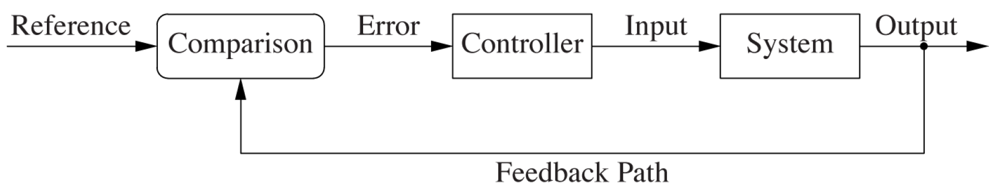

Compare this with an **open-loop system**, where the output is not taken into account.


## The components of a closed-loop system
A basic closed-loop system consists of a number of components that are shown in the first image. When an output in the system is produced, it is compared with the reference value (usually known as the **setpoint**). This comparison produces a *tracking error*, which is the deviation of the output from the setpoint:
> tracking error = setpoint - previous output

The tracking error is used in the **controller** to determine the system's next input. Usually when the tracking error is positive (the previous output was too low) the controller has to produce a new control input that will raise the output of the process. The reverse holds for the case where the tracking error is negative.

Notice that the controller does not need any knowledge about the system's internal behavior but instead only needs to know the **directionality** of the process: does the input need to be raised or lowered in order to raise the output value? In practice both situations will occur: increasing the power of a heating element will lead to an increase in temperature, whereas an increase of the power of a cooler will lead to a decrease.

Besides the directionality, the controller also needs to know the **magnitude** of the correction. After all, the controller could overcompensate a positive tracking error, resulting in a negative tracking error. This often results in a **control oscillation**, which is rarely desirable.

However, it can be worse: if the controller overcompensates a positive tracking error in such a way that the resulting negative tracking error needs an even bigger compensating action, then the amplitude of the oscillations will grow over time. In that case the system will become unstable and will blow up. It needs no explanation that this unstable behavior needs to be avoided.

Besides overcompensating, a controller can also show timid or slow behavior: the corrective actions are too small. This causes tracking errors to persist for a long time and makes the system responding slow to disturbances. Although this is less dangerous than instability, this slow behavior is unsatisfactory as well.

In conclusion we can say that we want the magnitude of the controller's correction as large as possible such that it does not make the system unstable.

## Iterative schemes
A closed-loop system is based on an iterative scheme, where each control action is supposed to take the system closer to the desired value. Repeating the process of comparing the previous output with the desired value and using that to calculate the next iteration's input will reduce the error. As with each iterative scheme, we are presented with three fundamental questions:

1. Does the iteration converge?
2. How quickly does it converge?
3. To what value does it converge?

The answer to the first question lies in the settings of the system's controller. If the controller does not overcompensate too much (if the amplitude of the oscillations will never build up), the iteration will converge.

The same holds for the second question: if the controller is set to react slowly, it will take longer for it to converge. To make the iteration converge quickly, the controller has to be set such that it will produce the largest correction without causing oscillations.

Although the third question may seem obvious (the iteration will converge to the setpoint), sometimes the settings of the controller will result in converging to an incorrect value, which might be higher or lower than the setpoint.

It turns out that the three goals that are related to these questions (stability, performance and accuracy) are hard to be achieved simultaneously. The design of feedback systems will most often involve trade-offs between stability and performance, since a system that responds quickly will tend to oscillate. It depends on the situation which aspect will be emphasized.

## Example: cache simulation
To illustrate the aspects of a feedback system that are discussed in on this page, we will simulate behavior of a system that controls the size of a cache. In this example we will not implement a cache but rather simulate its hit rate by the following function:

```scala
def cache(size: Double): Double = math.max(0, math.min(1, size / 100))
```

### Experiment 1 - Cumulative controller
In our first simulation we will have a constant setpoint (or hit rate for cache requests) of 60%.

```scala
def simulation(): Observable[Double] = {
    val k = 160
	def setPoint(time: Int): Double = 0.6
	def cache(size: Double): Double = math.max(0, math.min(1, size / 100))

	Observable((subscriber: Subscriber[Double]) => {
		val hitrate = PublishSubject[Double]

		Observable.from(0 until 30)
			.map(setPoint)
			.zipWith(hitrate)(_ - _)					// calculate hitrate
			.scan((sum: Double, e: Double) => sum + e)	// calculate cumulative hitrate
			.map { k * _ }								// calculate next input
			.map(cache)									// calculate newest output
			.subscribe(hitrate)

		hitrate.subscribe(subscriber)
		hitrate.onNext(0.0)
	})
}
```

Running this simulation with different values of `k` will yield the following (we will come back to the meaning of `k` in a later stage):

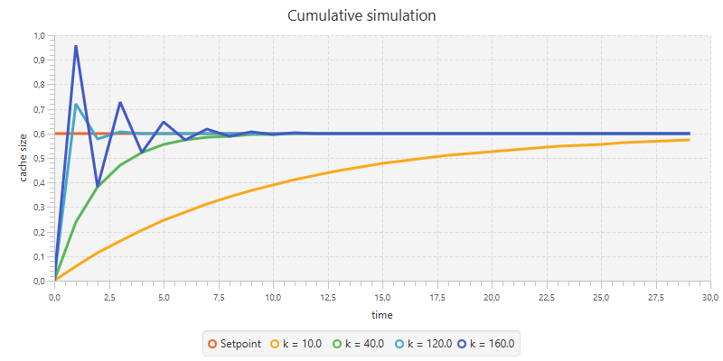

For `k = 10` we see that it takes more than 30 iterations to get only close to the hit rate. Also `k = 40` turns out to be a bit slow (but faster than the previous), for which it takes 27 iterations to get to the desired value (although the output is already at 59.3% after 9 iterations). With either one of these settings the controller would be effective in the long run, but will take to much time to react to changes.

On the other hand, if we look at the case of `k = 160`, we see a clear overshooting in the first iteration to a value of 96%, from which it overshoots again to 38.4% and so on. Just as the case of `k = 40` it will get to the desired hit rate after 27 iterations, although it already is really close after 9 iterations.

The same (but less drastic) holds for `k = 120`: it overshoots the first time to 72%, but already converges to 60% after 8 iterations.

Searching for the most optimal value for `k` is obvious in this case and already becomes clear in the code: `k = 100`. With this configuration the controller is already at the desired value after one iteration. Although it is easy to find in this example, in practice it often turns out to be much more difficult to find the most optimal value for `k`.

It should be noticed in the code that we use a feature of the controller that is not yet discussed so far: calculating the cumulative error and using this value for producing the next input rather than using the tracking error itself. We will get to this technique later. We can however already show the difference between using and not using this cumulative error.

### Experiment 2 - Noncumulative controller
We get to a noncumulative version of the simulation by removing the following single line from the previous listing: `.scan((cum: Double, e: Double) => cum + e)`. Running the simulation with the same values for `k` will yield the following chart:

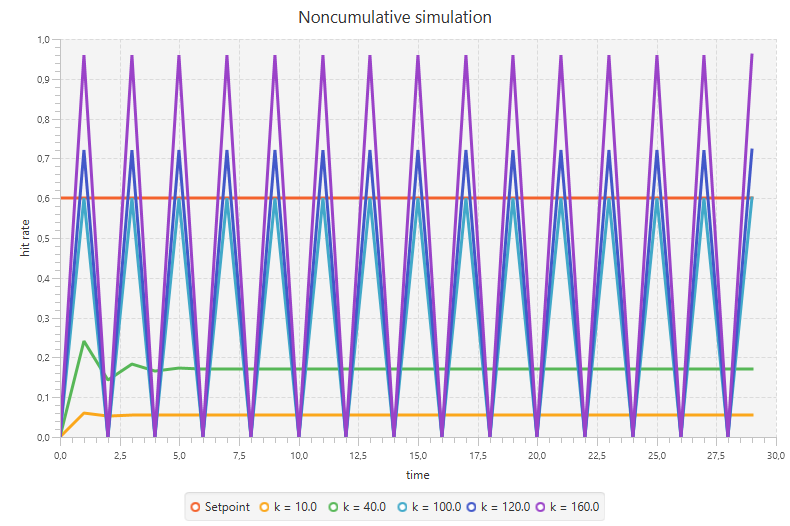

These results look far from right. The smaller values for `k` will converge, although not to desired value. The larger values however will not converge but will rather oscillate between 0 and `setpoint * k / 100`. Looking closely to what happens, reveals that this is due to the way the `cache` function is implemented (it maps negative values to 0). If we would change this function to `def cache(size: Double): Double = size / 100` (notice that this would not make sense in the context of a cache), we see an overshooting that will explode in the long run. Extrapolating will yield that after 30 iterations we get an output of over 300000!

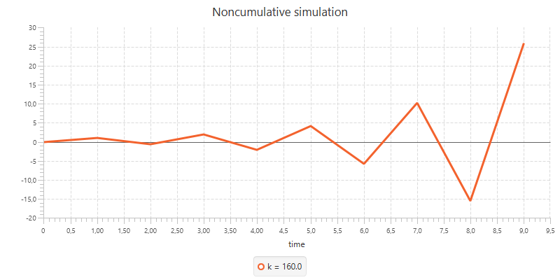

### Experiment 3 - Changing setpoint
Now let's see what happens if we change the setpoint during the experiment. In order to do so we change the definition of the `setpoint` function to:

```scala
def setPoint(time: Long): Double = if (time < 30) 0.6 else if (time < 60) 0.8 else if (time < 90) 0.1 else 0.9
```

For this experiment we use the cumulative implementation again, since this gives us the desired outputs.

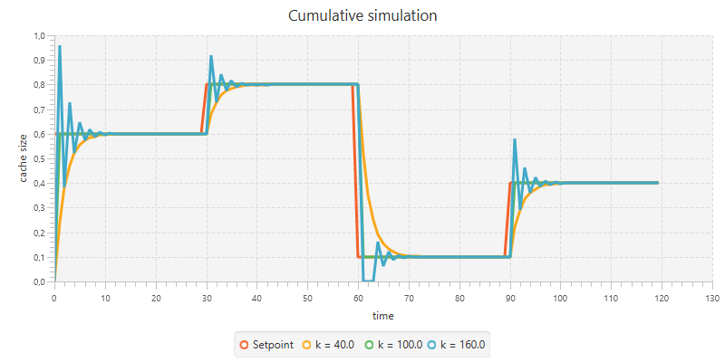

As expected, the simulations follow the setpoint values with their own characteristics. `k = 100` again is the most optimal here and reaches the desired value immediately after it is changed. The case of `k = 160` again overshoots the setpoint and reaches the desired value in that way, whereas `k = 40` slowly converges by taking smaller steps.

## Summary
We have seen the basic components that together make up a feedback system. First we compare the system's previous output with the reference value (or **setpoint**) and feed the resulting **tracking error** into the **controller**. Based on this, the controller calculates the system's next **input**. The system's **output** is then compared again with the setpoint.

The controller only needs to know about the **directionality** of the process and the **magnitude** correction. It does not need any understanding of the internal workings of the controlled system. The magnitude of the correction determines whether the controller will overcompensate or react too slow. Overcompensating may lead to heavy oscillations that can cause the system to get out of control.

#System dynamics
In the previous [cache example](#example-cache-simulation) we made the assumption that the cache responds immediately to a change. Although this may seem an obvious choice (after all, we are manipulating the state of a computer program, which can be changed in an instant), there are cases where we have to be more careful. While working with cloud computing, requesting 20 more instances from the cloud data center will take a couple of minutes before they 'arrive'. In the meantime these instances are not available for any requests, but when they are online, they are immediately fully operational. Handling this with a feedback system is a harder task, since there is a certain time between the control action and the response.

Although in the virtual world these delays only occur in certain systems, they always occur in the physical world. Besides delays, we also have to deal with lags and inverse responses if we are designing a feedback system that involves physical world objects. This is due to the fact that this world is continuous, where objects cannot move from a certain position A to another position B in an instant. In fact they are bounded to a certain non-infinite velocity, which may require large amounts of force, energy and power, which may not be available or even impossible to supply. This makes designing feedback systems very hard and often results in error prone outputs.

##Lag, delay and inverse response
For a good understanding, we need to take a closer look at lags, delays and inverse responses first. We will do so using some examples.

A system has **lag** when it only partially responds to a control input. The response will start immediately, but it will take while before it reaches the value that was given as the control input. This is also called an **immediate partial response**. An example of this is applying heat to a pot on the stove. As soon as the heat is applied, the temperature in the vessel gradually starts to rise. When the heat is turned of, the temperature will gradually drop back to the environment's temperature.

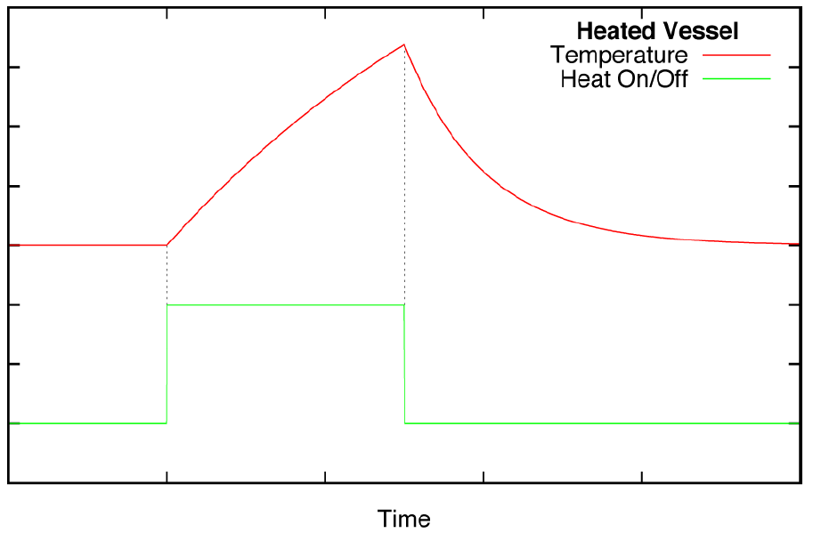

**Delay** manifests itself by not responding immediately to the control input. Over some period of time, the control input does not have any effect on the controlled system. Only after that period, the control input has *full* effect on the system. In the cloud computing example we saw that when the control input asks for 20 more instances, it takes a while before these are available. But when these are available, they are there entirely (not just partially).

In practice we often see a combination of delay and lag. As an example we set up a feedback system for the water level in a tank, where the water input comes from a long pipe feeding into the tank. When we fire the control input, the water starts to flow from the valve at the beginning of the pipe to the tank. However, it will take some time before the water level starts to rise, since the water needs to travel a certain distance (this is the delay). The water that comes in tank will however not cause the tank to be at the desired water level immediately but rather fill up slowly (this is the lag). This process is depicted in the image down below.

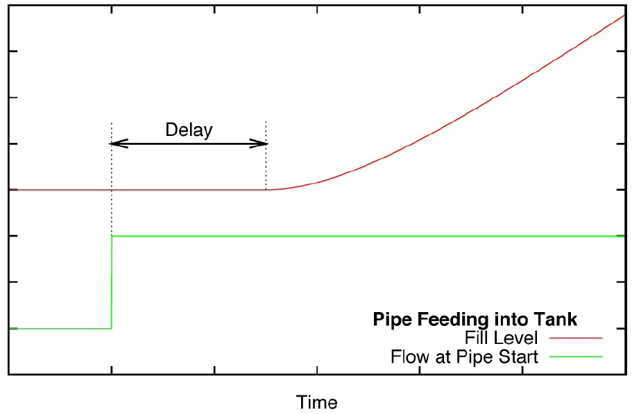

Besides lag or delay, a system can also give an **inverse response**, also referred to as a **non-minimum phase system**. When a control action is applied in a certain direction, the system responds by first going into the other direction, before going along with the control action. This causes a behavior as depicted in the image down below. An example of this is a flexible fishing rod: when it is yanks *back*, its tip will first move *forward*.

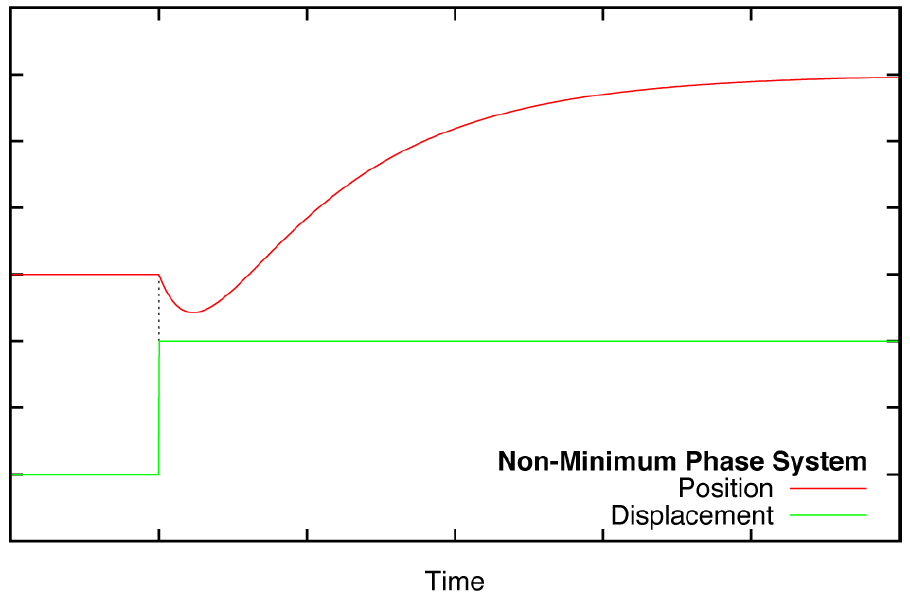

##Response components
In general we can divide the system's responses to a control action into two categories: forced and free response. The **forced response** is caused by the external disturbance due to the control action, whereas the **free response** is cause by the system's internal structure. For the heated vessel the forced response is the temperature going up because of the heat supply. However, as soon as the heat supply is turned off, the temperature drops down again, which is due to its free response of matching the temperature with its environment. On the other hand, the water tank does not have any free response: the water level stays the same if no water flows from the pipe into the tank.

From another perspective we can divide the system's response into **transient components**, which decay over time and **steady-state components**. We can view the latter as the component which realizes the goal of a control action, whereas the transient component is some form of an unwanted side-effect, which decays over time. The time it takes for all the transient components of a control action to disappear makes a good metric for the performance of the feedback system.

As an example, let's look at a [mass on a spring](http://en.wikipedia.org/wiki/Simple_harmonic_motion#Mass_on_a_spring). When we give the other end of the spring a sudden jerk, the mass will begin to oscillate, which will eventually die away (depending on the spring constant), after which we are left with an overall displacement of the mass. Here the final displacement is the goal of our feedback system and thus the steady-state component of the response. The oscillation is a transient component, which fades away after a while.

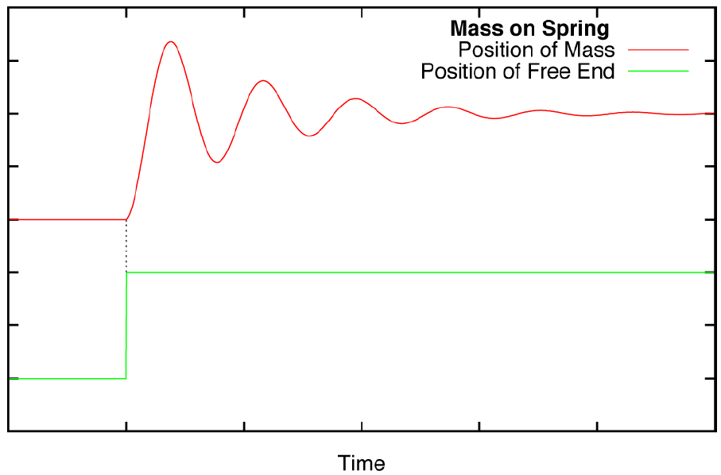

##Example: Cache with delay
To illustrate what a delay will do to a feedback system in practice, we will extend the [cache example](#experiment-3---changing-setpoint) by adding a delay to the system. In order to do so, we need to change the output stream (`val hitrate`) from being a [`PublishSubject`](https://github.com/ReactiveX/RxJava/wiki/Subject#publishsubject) into a [`BehaviorSubject`](https://github.com/ReactiveX/RxJava/wiki/Subject#behaviorsubject) and develop an [extension method](https://coderwall.com/p/4clu3a/extension-methods-in-scala) that will cause the delay.

```scala
def simulation(): Observable[Double] = {
	def setPoint(time: Int): Double = if (time < 30) 0.6 else if (time < 60) 0.8 else if (time < 90) 0.1 else 0.4
	def cache(size: Double): Double = math.max(0, math.min(1, size / 100))

	Observable((subscriber: Subscriber[Double]) => {
		val hitrate = BehaviorSubject[Double]

		Observable.from(0 until 120)
			.map(setPoint)
			.zipWith(hitrate)(_ - _)
			.scan((sum: Double, e: Double) => sum + e)
			.map { k * _ }
			.map(cache)
			.delay(delay, 0.0)
			.subscribe(hitrate)

		hitrate.subscribe(subscriber)
	})
}
```

As discussed before, delay manifests itself by not responding immediately to the control input. Thus, during the delay, the output lags behind a number of iterations. Reasoning back to the start of this feedback system, it follows that there was a certain initial output value to the system before it responded to the first control actions. From this, the implementation of the extension method `delay(steps: Int, initVal: T)` is as follows:

```scala
object DelayExtension {
	class DelayObservable[T](obs: Observable[T]) {
		def delay(steps: Int, initVal: T) = (Observable.from(List.fill(steps)(initVal)) ++ obs).slidingBuffer(steps, 1).map(_.head)
	}
	
	implicit def delayObservable[T](obs: Observable[T]) = new DelayObservable(obs)
}
```

In this implementation we start off with a number of constant initial values, followed by the original stream of values. On this we use a sliding buffer of side `steps` (the number of iteration of the delay), which causes the stream to buffer and wait for the right amount of values.

With only 1 step of delay and using the control gain `k = 160` (which used to work fine without delay) we already get very bad behavior. The cache's hit rate continuously oscillates between 0% and 100% and causes unstable behavior.

A better control gain is `k = 50`, which still overshoots a little, but stabilizes soon on the requested hit rate. This overshooting is almost gone at `k = 30` and not even there at `k = 20`. We see here that the latter even is maybe a bit to careful and takes too small steps.

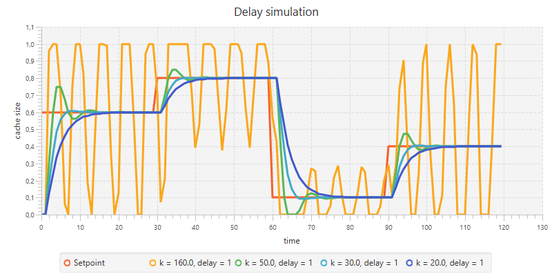

When we use a delay of 2 iterations, we find that the range of suitable values for the control gain shrinks quite a bit: `k = 50` is not suitable anymore to stabilize the hit rate within 30 iterations. `k = 30` only barely makes it to stabilize and `k = 20` also overshoots a bit, but stabilizes right after that. We also see `k = 10`, which is not sufficient enough to stabilize within 30 iterations.

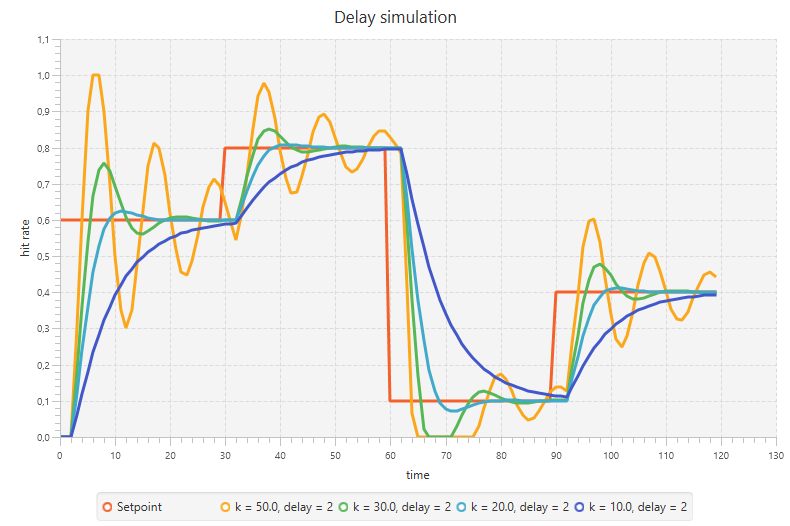

A longer delay makes it even worse! When set to 5 iterations, we cannot find a suitable value that stabilizes within 30 iterations. `k = 30` and `k = 20` totally overshoot the hit rate, whereas `k = 15` and `k = 10` make good attempts in overshooting a bit, but are too slow to catch up.

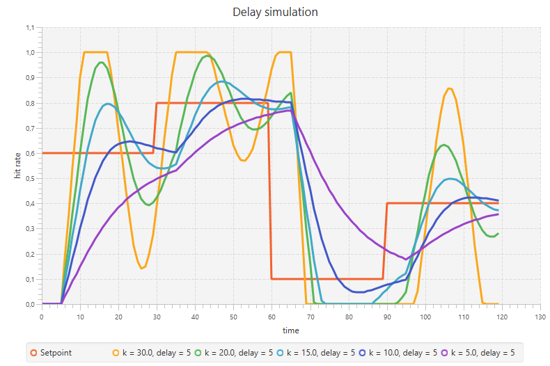

It is clear that the longer a delay is, the worse gets on finding a suitable value for the control gain that stabilizes to the setpoint within a reasonable amount of iterations. If possible, a delay should be avoided in the phase of designing a feedback control system.

## Summary
The controlled systems often exhibit some **internal behavior** that we need to take into account while designing a feedback system. It might be that the system exhibits **lag**, which causes it to only respond partially to the input. Another type of internal behavior is **delay**, where it takes a certain amount of time to respond to the control input. Also, the system might have a **non-minimum phase**, causing it to first go the opposite way before going along the control input values.

The response of the control system consists of two components: **steady-state**, which realizes the goal of the control action, and **transient**, which is some form of unwanted side-effect that decays over time. The time it takes to decay is a good metric for the quality of the feedback system.

#Controllers
Previously we have seen how a feedback system (see the image below) is constructed by looping the controlled system's output `y` back into a comparison with a reference value `r`, and providing the resulting error `e` to a controller `K`, which generates the next input `u` for the controlled system `H`. In this section we will discuss the role of the controller in a feedback system. Its most obvious role is to do the 'smart' numerical work, but we also need to consider the different types of controllers, which may improve the stability, performance and accuracy of the system as a whole.

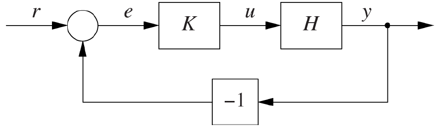

When designing a feedback system for controlling the size of a cache we need to consider what the input and output of the cache itself are within the feedback loop. Our reference value is a desired hit rate, which is depicted as a value between 0 and 1, as is the cache's output, to which it is compared. From this comparison, we send the error (`desired value - output`) to the controller, which is a value in the range -1 to 1. The controller then needs to calculate a new size for the cache and therefore needs to convert a ratio into a size.

The same holds for designing a feedback system for the example of a pipe feeding into a water tank. Here the water tank's output might be a ratio (to what percentage it is filled) or a volume (how many cubic meters of water are in), which the controller needs to convert into an action on the water supply. This action depends on the type of water supply: can it be only *opened* and *closed* or are there more states in between?

##Controller types
In general we can thus say that the controller serves the purpose of translating the controlled system's output signal into its next input signal. But as we just saw, the controller might be different, depending on the situation.

###On/Off control
The simplest controller is the on/off switch. Whenever the error is positive, the controlled system is turned on and visa versa. This is a very simple approach, but in practice not very effective since the system will not settle to a steady state. It will rather oscillate rapidly between its two states.

To show this behavior, let's implement a cruise control feedback system that uses an on/off controller. To keep the behavior of the cruise control simple, we expect any changes to be applied immediately, without any form of lag or delay. We define a class `SpeedSystem` which has a function `interact(setting: Boolean): Int` which respectively increases and decreases the `speed` variable depending on the `setting: Boolean` being `true` or `false`. We also define speed limits that vary over time in the `setPoint` function.

```scala
class SpeedSystem(var speed: Int = 10) {
	def interact(setting: Boolean) = {
		speed += (if (setting) 1 else -1)
		speed
	}
}

def simulation(): Observable[Int] = {
	def setPoint(time: Int): Int = if (time < 10) 15 else if (time < 20) 10 else 20
	val ss = new SpeedSystem

	Observable(subscriber => {
		val speed = BehaviorSubject(ss.speed)
		speed.subscribe(subscriber)
		
		Observable.from(0 until 40)
			.map(setPoint)
			.zipWith(speed)(_ - _)
			.map { x => if (x > 0) true else false }
			.map(ss.interact)
			.subscribe(speed)
	})
}
```

This results in the diagram below. Here we can clearly see the oscillating behavior of the system, rather than stabilizing it on the desired value.


To improve this controller a bit, we can introduce a dead zone or hysteresis. The former only sends an `on` signal to the system when a certain threshold is exceeded. The latter (also known as [Schmitt trigger](http://en.wikipedia.org/wiki/Schmitt_trigger)) maintains the same corrective action when the tracking error flips from positive to negative, until some threshold is exceeded. The latter is often used in conventional heating systems.

###Proportional control
To improve the control we have over the system, we need to come up with something better than an on/off controller. An obvious step is to take the magnitude of the error into account when deciding on the magnitude of the corrective action. This implies that a small error leads to a small correction, whereas a large error leads to a greater corrective action. To achieve this, we let the control action be proportional to the tracking error:

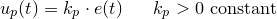

Here  is the controller gain, which is a positive constant.

Although this controller might be very useful in some cases, it shows one of its weaknesses when applied to the cruise control example. To do so, we first need to redefine the `SpeedSystem` class, since we now provide a `power: Double` rather than a `setting: Boolean`. If the `power` is zero or lower, the speed drops by 10%; else we increase the speed by the given power.

```scala
class SpeedSystem(var speed: Double = 10) {
	def interact(power: Double) = {
		if (power <= 0) {
			speed = (0.90 * speed) roundAt 1
		}
		else {
			speed = (speed + power) roundAt 1
		}
		speed
	}
}
```

Now we can use the standard pattern for the simulation:

```scala
def simulation(): Observable[Double] = {
	def setPoint(time: Int): Int = if (time < 20) 15 else if (time < 40) 5 else 20
	val ss = new SpeedSystem
	
	Observable(subscriber => {
		val speed = BehaviorSubject(ss.speed)
		speed.subscribe(subscriber)
		
		Observable.from(0 until 60)
			.map(setPoint)
			.zipWith(speed)(_ - _)
			.map { k * _ }
			.map(ss.interact)
			.subscribe(speed)
	})
}
```

In the diagram below we see the results with two values for . These simulations show the typical behavior of a proportional controller. The simulation with `k = 0.2` simply never reaches the setpoint but rather stabilizes on a different value. In this case the actual stabilization value is just a little bit off, but a similar case was already shown in the [non-cumulative cache example](#experiment-2---noncumulative-controller).

The other simulation (`k = 0.5`) does reach the actual setpoint, from which it follows that the next tracking error will be zero. This causes the controller to output zero, which is supplied to the `SpeedSystem`. As discussed before, this causes the speed to drop with 10%, from which the system can start rising the speed again.


What happens here in general is that the proportional controller can only produce a nonzero output if it gets a nonzero input. This directly follows from the equation above. As the tracking error diminishes, the controller output will become smaller and eventually will be zero. However, some systems (like the cruise control system or a heated pot on a stove) need a nonzero input in the steady state. If we use a proportional controller in such systems, the consequence will be that some residual error will persist; in other words the system output `y` will always be less than the desired setpoint `r`. This phenomenon is known as *proportional droop*.

###Integral Control
To solve problems caused by proportional droop, we introduce a new type of controller. This controller does not look at the *current* tracking error, but uses the *sum of all previous tracking errors* to produce its newest control action. As we know from mathematics, in a continuous stream a sum becomes an integral (hence its name), resulting in the following equation.


In our examples this controller is implemented as a `scan` operation, followed by a `map` and can be found in previous experiments like the [cumulative cache experiment](#experiment-1---cumulative-controller):

```scala
trackingError.scan((sum: Double, e: Double) => sum + e).map { k * _ }
```

Most often, this controller is used in combination with the proportional controller in order to fix the earlier discovered problems with the nonzero input in the steady state phase. The integral term in this so-called *PI controller* takes care of this by providing a constant offset. When the proportional term is zero (due to the tracking error being zero), the integral term will not turn zero, since it takes the historical errors into account as well.

We can show the effect of combining the proportional  and integral controllers by modifying the cruise control simulation. We add a class that holds the proportional and integral terms and replace `.map { k * _ }` from the previous implementation with `.scan(new PI)(_ work _).drop(1).map(_.controlAction)`. Notice that we here drop the first emitted item: this is the initial item `new PI` which we do not want in the control loop but rather be there as a seed for what comes in the first control iteration.

```scala
class PI(val prop: Double = 0, val integral: Double = 0) {
	def work(error: Double): PI = {
		new PI(error, integral + error)
	}

	def controlAction(kp: Double, ki: Double) = {
		prop * kp + integral * ki
	}
}
```

```scala
def simulation(): Observable[Double] = {
	def setPoint(time: Int): Int = if (time < 20) 15 else if (time < 40) 5 else 20
	val ss = new SpeedSystem
	
	Observable(subscriber => {
		val speed = BehaviorSubject(ss.speed)
		speed.subscribe(subscriber)
		
		Observable.from(0 until 60)
			.map(setPoint)
			.zipWith(speed)(_ - _)
			.scan(new PI)(_ work _)
			.drop(1)
			.map(_.controlAction(kp, ki))
			.map(ss.interact)
			.subscribe(speed)
	})
}
```

By using this code sample we find a correct implementation for the cruise control system. Notice that we still use `kp = 0.5` and that we only need a very slight integral correction with `ki = 0.001` to achieve this.

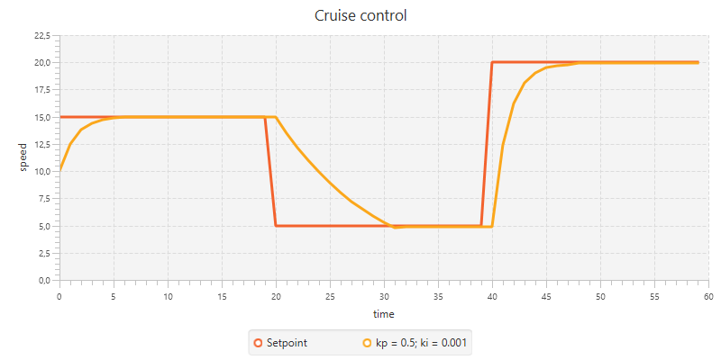

### Derivative control
Besides the proportional controller and integral controller, which respectively control based on the present and the past, we can also try to control a feedback system based on a prediction of the future. This is done by the derivative controller. From mathematics we know that the derivative is the rate of change of some quantity. Therefore we can conclude that if the derivative of the tracking error is positive, the tracking error is currently growing (and vice versa). From this conclusion we can then take action and react to changes as fast as possible (before the tracking error has a chance to become large).

Mathematically we can express the derivative controller by the following equation:

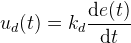

Even though '*anticipating the future*' sounds promising, there are a number of problems with the derivative controller. First of all a sudden setpoint change will lead to a large momentary spike, which will be the input of the controlled system. This effect is known as *derivative kick*.  
Besides that the input signal of the controller can have a high-frequency noise. Taking the derivative of such a signal only makes things worse by enhancing the effect of the noise.

### PID control
The most common use of the derivative controller is in combination with the proportional and integral controllers, forming a three-term *PID controller*. Here we use all three controllers and sum the outcomes.


We implement this in the same way as we did for the PI controller:

```scala
class PID(val prop: Double = 0, val integral: Double = 0, val deriv: Double = 0, prevErr: Double = 0) {
	def work(error: Double, DT: Double = 1): PID = {
		new PID(error, integral + error, (error - prevErr) / DT, error)
	}

	def controlAction(kp: Double, ki: Double, kd: Double) = {
		prop * kp + integral * ki + deriv * kd
	}
}
```

Notice that the function `work` takes a parameter `DT` with default value `DT = 1`. This value is used in calculating the derivative to account for multiple iterations within one time unit. If time is measured in seconds and there are 100 control actions, then `DT = 0.01`. Since our simulations currently do not depend on the time unit, we can assume that we do 1 control action per time unit, from which it follows that `DT = 1`.

Also notice that with introducing this controller, the PI controller is needed anymore, since it is equivalent to a PID controller with `kd = 0.0`.

## Summary
In this section a number of controllers have been discussed. The most primitive one is the **on/off controller**. This can only signal the controlled system to turn on or off. Its results are quite poor and often cause oscillating behavior.

An improvement is introduced in the **proportional controller**, which takes the tracking error and multiplies it with some constant . This controller performs well as long as the tracking error is not close to zero. Some types of controlled systems still need a nonzero input when the tracking error gets zero. This is what a proportional controller cannot offer.

To solve this issue, an **integral controller** can be added. This keeps track of the sum of all previous tracking errors and multiplies that with its constant 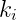. Together with the proportional controller, this controller makes up the **PI controller**, which combines the power of both.

Besides reacting to the present tracking error and taking the past into account, we can also try to predict the future. We do this with the **derivative controller**, which takes the change of the tracking error and multiplies that with the constant 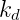. Together with the PI controller, the **PID controller** is formed.

#Simulation
In this section we will discuss the topic of simulating feedback control systems and provide a simulation framework that was built during this study. We will later use this framework in a couple of case studies.

There are a number of reasons why we need the ability to simulate the behavior of a control system.
* First of all, the behavior of a control system might be unintuitive or unfamiliar. To develop intuition for the abstract problem we can use simulations and thus get a better understanding of control problems that arise in the real world.
* In most cases it is not possible to do extensive testing and experimenting on real-world machines. Often they are too big, too expensive, too expensive, too dangerous or simply not available. And if they are available, tests will mostly be too time consuming to conduct serious experiments. Therefore simulations will suit better.
* The most difficult part is to implement controllers, filters, etc. according to abstract concepts like *transfer functions*. Simulations can help with a better understanding and make these concepts more concrete.
* Finally, no control system will ever be put into production unless it has proven itself to function correctly. Therefore, simulations are not *just for fun*, but form a crucial step in the design of a feedback control system.

In this section of the blog we will discuss a simulation framework that was built for this study. Also we will go over a number of case studies by using this framework.

##Time
One of the most important parts of the simulation framework is the simulation of time. For computer systems we are given a choice between two possible representations. We can use real time (also know as '*wall-clock*' time) where the controlled system evolves according to its own rules and dynamics, independent from control actions. In this case, control actions will usually occur periodically with a fixed time interval between two actions. Another choice is to use control time (also known as '*event time*'). Here the system does not evolve between two control actions, hence the time is synchronous with the control actions. Notice that this is the type of time that was used in the earlier examples.

In a simulation, the time is determined by the number of simulation steps. To convert this to a simulation of real time, we must assume that each simulation step has exactly the same duration (measured in real time). Therefore the steps in the simulation correspond to a certain duration in real time. Hence we need a conversion factor `DT` that translates simulation steps into real time durations.

##Simulation framework
In order to model every component in the simulation framework, we use a `Component` trait (or interface) containing two abstract functions: `update` and `action`. The former is used to iterate to the component's state in the *next* simulation step, based on its current state and an update parameter `u`. The latter is used to calculate the action that needs to be taken at in the *current* simulation step. To see what is going on inside a component, another abstract function `monitor` is provided that returns a `Map[String, AnyVal]`. This needs to be implemented on each component.

Furthermore it should be noticed that components can be concatenated in order to compose more complex components. In other words, `Component` can be viewed as a monoid, hence the `++` operator. Also, we can implement `map` on a `Component` in order to apply functions to the output signal of a component (`Component` is a functor).

```scala
trait Component[I, O] {
	def update(u: I): Component[I, O]
	def action: O
	def monitor: Map[String, AnyVal]

	def ++[Y](other: Component[O, Y]): Component[I, Y] = {
		val self = this
		new Component[I, Y] {
			def update(u: I): Component[I, Y] = {
				val thisComp = self update u
				val otherComp = other update thisComp.action
				thisComp ++ otherComp
			}
			
			def action: Y = other.action
		}
	}

	def map[Y](f: O => Y): Component[I, Y] = {
		val self = this
		new Component[I, Y] {
			def update(u: I): Component[I, Y] = self update u map f

			def action: Y = f(self action)

			def monitor = self.monitor
		}
	}
}
```

###Controller
Controllers convert the tracking error in a system input. As discussed before, the most common controller is the `PIDController`. Here `update` calculates the new integral and derivative components of this controller and returns a new instance with these new values, whereas `action` calculates the value of the control action, which serves as an input for the controlled system. Notice that here the earlier discussed `DT` factor enters the calculations twice.

```scala
class PIDController(kp: Double, ki: Double, kd: Double = 0.0, integral: Double = 0, deriv: Double = 0, prev: Double = 0)(implicit DT: Double) extends Component[Double, Double] {
	def update(error: Double): PIDController = {
		val i = integral + DT * error
		val d = (error - prev) / DT
		
		new PIDController(kp, ki, kd, i, d, error)
	}

	def action = prev * kp + integral * ki + deriv * kd

	def monitor = Map("PID controller" -> action)
}
```

A more advanced implementation can be found in `AdvController`, which adds two features to `PIDController`. First it has a filter for smoothing the derivative term. Supplying a positive value `0 < s < 1` will result in applying a recursive filter on the derivative term. Furthermore a parameter `clamp` is added, which prevents *integrator windups*. This means that when the controller's output exceeds a certain limit (defined by `clamp`), the controller will not update its value during the next round.

Regarding the latter feature, this controller can be used to control a heating element. Here a lower bound can be set on 0° Celsius, since it is usually impossible for a heating element to produce negative heat flow.

```scala
class AdvController(kp: Double, ki: Double, kd: Double = 0, clamp: (Double, Double) = (-1e10, 1e10), smooth: Double = 1, integral: Double = 0, deriv: Double = 0, prev: Double = 0, unclamped: Boolean = true)(implicit DT: Double) extends Component[Double, Double] {
	def update(error: Double): AdvController = {
		val i = if (unclamped) integral + DT * error else integral
		val d = smooth * (error - prev) / DT + (1 - smooth) * deriv
		
		val u = kp * error + ki * integral + kd * deriv
		val un = clamp._1 < u && u < clamp._2
		
		new AdvController(kp, ki, kd, clamp, smooth, i, d, error, un)
	}

	def action = prev * kp + integral * ki + deriv * kd

	def monitor = Map("Advanced controller" -> action)
}
```

###Filters and actuators
Besides controllers, we also might want to make use of other components. These are the actuators and filters. The most obvious one (`Identity`) just reproduces its input value and emits that as its output.

```scala
class Identity[A](value: A = 0) extends Component[A, A] {
	def update(u: A): Identity[A] = new Identity(u)
	
	def action = value

	def monitor = Map("Identity" -> action)
}
```

Another actuator is the `Integrator`, which takes the sum of its inputs and returns its current value. Notice that since we are calculating an integral here and that therefore we need to multiply the sum by factor DT to convert from simulated steps to real time.

```scala
class Integrator(data: Double = 0)(implicit DT: Double) extends Component[Double, Double] {
	def update(u: Double): Integrator = new Integrator(data + u)
	
	def action = DT * data

	def monitor = Map("Integrator" -> action)
}
```

Finally we present two smoothing filters. The first, `FixedFilter`, calculates the unweighted average of the last `n` elements.

```scala
class FixedFilter(n: Int, data: List[Double] = List()) extends Component[Double, Double] {
	def update(u: Double): FixedFilter = {
		val list = (if (data.length >= n) data drop 1 else data) :+ u
		new FixedFilter(n, list)
	}
	
	def action = data.sum / data.length

	def monitor = Map("Fixed filter" -> action)
}
```

The second filter, `RecursiveFilter` is an implementation of the exponential smoothing algorithm. This adds the current value `u` to the previous filter output in order to return the current step's output.

```scala
class RecursiveFilter(alpha: Double, y: Double = 0) extends Component[Double, Double] {
	def update(u: Double): RecursiveFilter = {
		val res = alpha * u + (1 - alpha) * y
		new RecursiveFilter(alpha, res)
	}
	
	def action = y

	def monitor = Map("Recursive filter" -> action)
}
```

###Convenience functions
Finally we introduce a number of convenience functions with the intention of hiding most of the boilerplate code. First we have a number of basic setpoint functions. These can be used as input for a feedback loop, but can also be composed to get a more complex setpoint function by multiplying the result of such a function with a scalar and/or adding with other functions.

```scala
object Setpoint {
	def impulse(t: Long, t0: Long)(implicit DT: Double) = if (math.abs(t - t0) < DT) 1 else 0

	def step(t: Long, t0: Long) = if (t >= t0) 1 else 0

	def doubleStep(t: Long, t0: Long, t1: Long) = if (t >= t0 && t < t1) 1 else 0

	def harmonic(t: Long, t0: Long, tp: Long) = if (t >= t0) math.sin(2 * math.Pi * (t - t0) / tp) else 0

	def relay(t: Long, t0: Long, tp: Long) = if (t >= t0 && math.ceil(math.sin(2 * math.Pi * (t - t0) / tp)) > 0) 1 else 0
}
```

Also we provide the boilerplate code for multiple types of loops. For now we discuss the `closedLoop` and come back later to other types of loops. This function is modeled after the extended version of a feedback control system, including the actuator and filter.

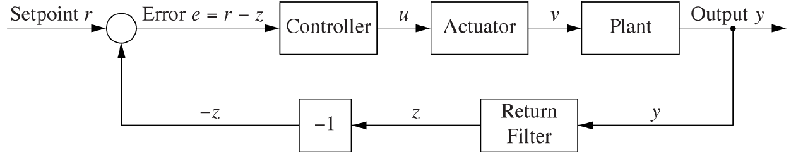

```scala
object Loops {
	def closedLoop[A](setPoint: Observable[A], seed: A, components: Component[A, A], inverted: Boolean = false)(implicit n: Numeric[A]) = {
		import n._
		Observable[A](subscriber => {
			val y = BehaviorSubject(seed)
			y drop 1 subscribe subscriber
			
			setPoint.zipWith(y)(_ - _)
				.map { error => if (inverted) -error else error }
				.scan(components)(_ update _)
				.drop(1)
				.map(_ action)
				.subscribe(y)
		})
	}
}
```

Notice that using the `closedLoop` function on a control system with controller, actuator, plant (the controlled system) and filter will require using the `++` operator in order to concatenate these components.

###Running example
To demonstrate the workings of these basics, let's implement a simple `Plant` (this is the controlled system) and see how this framework performs. First we implement `Boiler`:

```scala
class Boiler(g: Double = 0.01, y: Double = 0)(implicit DT: Double) extends Component[Double, Double] {
	def update(u: Double) = new Boiler(g, y + DT * (u - g * y))

	def action = y

	def monitor = Map("Boiler" -> action)
}
```

Then we can use this plant to create a small example program. We first initialize the `DT` variable (default to `1.0`) and construct a `setpoint` function from one of the convenience functions as well as the time, plant and controller. Finally we put these all in the `closedLoop` function and print the result.

```scala
def simulation(): Observable[Double] = {
	implicit val DT = 1.0
	def setpoint(t: Long): Double = 10 * Setpoint.doubleStep(t, 10, 60)

	val time = (0L until 150L) toObservable
	val p = new Boiler
	val c = new PIDController(0.45, 0.01)

	Loops.closedLoop(time map setpoint, 0.0, c ++ p)
}
```

The results of running this example program will yield the following plot:

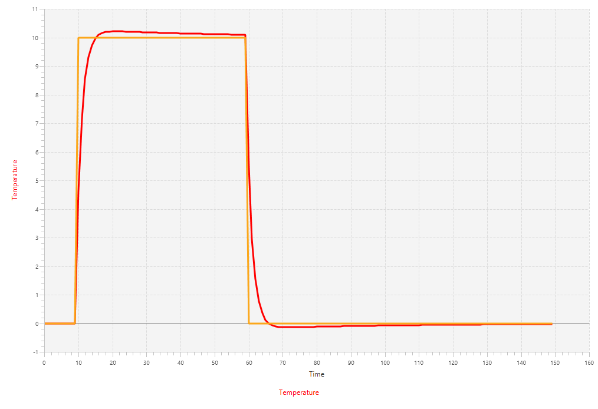

#Cache hit rate control
In computer science caches are used in various places in order to speed up the response to common queries or requests. Instead of doing the same long and slow calculation or disk operation again and again, we can save the result in memory the first time we receive the request. The next time a request comes in, we first look whether or not its result is already in the cache. We only choose to perform the calculation or disk operation if the result is not in the cache. From this we define a successful request as one whose result was in the cache already

A good metric for how well the cache performs is the hit rate, which is the success rate of requests. This metric can be influenced by altering the cache size as well as by which requests are done. Keeping the cache size constant can obtain a 100% hit rate if always the same request is done, but also might obtain a much lower hit rate if many different requests are done.

Unfortunately in practice we cannot control which requests are done, hence we can only adjust the size in order to increase the hit rate. Although in theory we could make the cache infinitely big, in practice we have a limited amount of space. To be more specific, we want to maintain a certain hit rate with as few space as possible.

##System design
We are going to construct a feedback control system that controls the cache size and hence tries to maintain a certain hit rate. A first hurdle is to choose an output quantity. Although a cache's output actually is the result of the request, we are only interested in whether or not this result was already in the cache. Therefore the cache's output can be modeled as a Boolean variable. The hit rate is then defined as the *trailing average number of successes over the last k requests*.

This directly gives us a second hurdle, this time a more mathematical one: *how large does k need to be*? In order to answer this question, we need to observe that (since each request results either in success or failure, a.k.a. a Boolean) requests can be regarded as [Bernoulli trials](http://en.wikipedia.org/wiki/Bernoulli_distribution). From the [classical central limit theorem](http://en.wikipedia.org/wiki/Central_limit_theorem#Classical_CLT) it follows that the standard deviation of such Bernoulli trials with size *k* is approximately 0.5/√*k*. If we want to have good control, we need to know the success rate to within at least 5% or better, hence *k* needs to be approximately 100.

Having solved these two issues we can now construct our feedback control system around the actual cache. To convert the Boolean results of the case into hit rates we will use a [FixedFilter](#filters-and-actuators).


The cache can now be implemented as follows:

```scala
class Cache(size: Int, demand: Long => Int, internalTime: Long = 0, cache: Map[Int, Long] = Map(), res: Boolean = false) extends Component[Double, Boolean] {

	def update(u: Double): Cache = {
		val time = internalTime + 1
		val newSize = math.max(0, math floor u)
		val item = demand(time)

		if (cache contains item) {
			val newCache = cache + (item -> time)

			new Cache(newSize toInt, demand, time, newCache, true)
		}
		else if (cache.size >= size) {
			val n = 1 + cache.size - size
			val vk = cache map { case (i, l) => (l, i) }
			val newCache = (cache /: vk.map { case (l, _) => l }.toList.sorted.take(n).map(vk(_)))(_ - _)

			new Cache(newSize.toInt, demand, time, newCache + (item -> time), false)
		}
		else {
			val newCache = cache + (item -> time)

			new Cache(newSize.toInt, demand, time, newCache, false)
		}
	}

	def action: Boolean = res

	def monitor = Map("Cache hit rate" -> action, "Cache size" -> cache.size)
}
```

##Controller settings
After having constructed the feedback system, we need to decide what kind of controller we will use. The most obvious candidate is the PID controller, which needs two or three parameters (depending on using it as a PI controller or PID controller). As discussed [previously](#Controllers), a PID controller is the sum of the proportional, integral and derivative control:


The parameters of this controller (,  and ) will make *the* difference between a good or bad functioning system; therefore choosing the correct values is an important task.

In order to retrieve these values, we need to take a closer look at the controlled system (the cache) first and discover what its behavior is. First we will look at the static process characteristics, which determines what the size and direction of the ultimate change in the process output is when an input of a certain size is applied. When the static behavior is known, we can use its results to determine the dynamic response: how long does it take for the system to respond to a sudden input change? Notice that both these experiments are done in an [open-loop setting](#Feedback systems) and without a controller. In the case of our cache we consider the controlled system to be the cache combined with the FixedFilter.

###Static process characteristics
To measure the static process characteristics we just have to turn on the controlled system, apply a steady input value, wait until the system has settled down and record the output. We do this in the following code sample. The demand is drawn from a Gaussian distribution with mean 0 and variance `demandWidth`. Then we construct the controlled system and follow the procedure described above: 

```scala
def simulation(): Observable[(Double, Double)] = {
	val demandWidth = 15
	def demand(t: Long) = math floor gaussian(0, demandWidth) toInt

	val p = new Cache(0, demand) map(if (_) 1.0 else 0.0)
	val f = new FixedFilter(100)
	staticTest(p ++ f, 150, 100, 5, 3000)
}

def gaussian(mean: Double, stdDev: Double) = new Random().nextGaussian() * stdDev + mean

def staticTest[A](initPlant: Component[Double, A], umax: Int, stepMax: Int, repeatMax: Int, tMax: Int): Observable[(Double, A)] = {
	val steps = (0 until stepMax).toObservable.observeOn(ComputationScheduler())
	val repeats = (0 until repeatMax).toObservable
	val ts = (0 until tMax).toObservable
	staticTest(initPlant, umax, steps, repeats, ts)
}

def staticTest[A](initPlant: Component[Double, A], umax: Int, steps: Observable[Int], repeats: Observable[Int], ts: Observable[Int]): Observable[(Double, A)] = {
	for {
		i <- steps
		u <- steps.size.single map { i.toDouble * umax / _ }
		plant <- repeats map { r => initPlant }
		y <- (ts map (_ => u) scan(plant))(_ update _) drop 1 map (_ action) last
	} yield (u, y)
}
```

Since we are working with some form of a stochastic process, we need to take into account that the pattern of requests might vary from time to time. Therefore we will simulate multiple scenarios of the static process characteristics with different values for `demandWidth`:


From these simulations we can derive that if we want a hit rate of 0.7, we need a cache size of about 40-70, assuming that a demandWidth of 15-35 is the most common situation.

###Dynamic response
The next step in determining the parameters of the PID controller is to conduct a step test to measure the dynamic response of the system. Performing this experiment is just a matter of turning on the system and observing what happens. First let the system be at rest initially (zero input). Then apply a sudden (preferably large) input change and record the development of the output value over time. If possible, do this a number of times in order to get a good signal-to-noise ratio.

```scala
def stepResponse[A, B](time: Observable[Long], input: Long => A, plant: Component[A, B]): Observable[B] = {
	(time map input scan plant)(_ update _) drop 1 map (_ action)
}

def simulation: Observable[Double] = {
	def demand(t: Long) = math floor Randomizers.gaussian(0, 15) toInt
	def input(time: Long): Double = 40

	val p = new Cache(0, demand) map(if (_) 1.0 else 0.0)
	val f = new FixedFilter(100)
	stepResponse(time, input, p ++ f)
}
```

Doing so with the implementation of a cache will yield the following data, gathered over the course of 5 iterations and applied with an input change of 40.


####Finding the first values
The analysis of this data can be done in multiple ways. A first option is to draw a tangent through the inflection point of the data and then use the construction below to find the values for K, τ and T which we will use in a later stage.


Although there are complete books written about finding these three values and what their relation is to the parameters of a PID controller, for us it is only necessary to understand what these values mean:

* **Process gain K** is the ratio between the value of the applied input signal and the steady-state process output after all transients have disappeared. In the construction above it is denoted as the height of the asymptote of the output.
* **Time constant T** denotes the time it takes for the process to settle to a steady state. Usually in this context 'settle' is defined as about 63% of its final value.
* **Dead time τ** is the initial delay until the first input changes will begin to have any effect on the output.

Unfortunately the data is more than often not as smooth as the red curve in the construction above. Since the data drawn from the experiment with the cache contains a lot of noise, it is a difficult task to find the inflection point and draw a tangent through it. What is a tangent to noisy data, after all? But besides that, it might be possible that (even when the data is smoothened enough) there is no inflection point at all. In that case, try to imagine where the inflection point would be if it would be there, and draw the tangent there. Of course, the values won't be as precise, but as we will see later, it is all a matter of eyeballing.

A second method of finding the values for K, τ and T is to fit a model through the data. Most commonly the following model is used to describe the step response of a process like the cache:

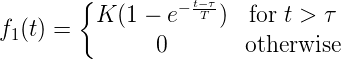

A little more complex model solves an issue with this simple model: it has no vanishing slope as t gets closer to τ.


By fitting either of these models onto the data, we will find the values for K, τ and T. Notice that both models give different results, as shown in the fittings of the respective models below:


In the following we will use the results found by fitting the simple model.

####Calculating the PID parameters
Once we have found values for K, τ and T, we can use multiple sets of tuning formulas (indicated as **Ziegler-Nichols**, **Cohen-Coon** and **AMIGO**) to find the parameters of the PID controller that we need to use. It should be noted that these sets will all give different results, which may vary considerably. Altogether these methods will give us however a good indication of the *range* where the parameters possibly lie. Respectively the Ziegler-Nichols, Cohen-Coon and AMIGO tuning formulas are given below. For each type of controller (P, PI and PID) the parameters ,  and  are specified:

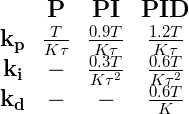

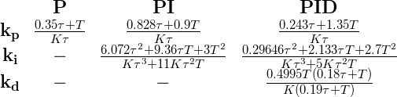


When using these formulas, keep in mind that K is the ratio of the applied input signal and the final steady-state process output. Therefore, divide K by the input signal first, before plugging it in the tuning formulas. Since the input signal was 40, the value to be plugged in for K is 0.71/40 = 0.01775, where the latter K is the one found in the analysis phase.

Choosing to control the system with a PI controller and using the tuning formulas we find the following results:

|     | Ziegler-Nichols | Cohen-Coon | AMIGO |
|:---|---:|---:|---:|
||192.7|239.3|48|
||4.3|7.5|1|
||0|0|0|

The next and final step is to try out values within these ranges by simulating the entire feedback system (controllers, actuators, controlled system, and filters included) as designed at the start of this page. The demand will be simulated by drawing values from a Gaussian distribution. Changes in demand will be taken into account by changing the mean and variance of the distribution at times `t = 3000` and `t = 5000`. The former change increases the variance from 15 to 35, keeping the mean at 0, such that more values will be asked for. The latter demand change brings the mean up to 100, causing the demand function to return entirely new values. Because of this, the cache will need to repopulate, which is expected to take some time.

```scala
def simulationForGitHub(): Observable[Double] = {
	def time: Observable[Long] = (0L until 10000L).toObservable observeOn ComputationScheduler()
	def setpoint(t: Long): Double = 0.7

	def gaus(tuple: (Int, Int)) = math floor Randomizers.gaussian(tuple _1, tuple _2) toInt
	def demand(t: Long) = gaus(if (t < 3000) (0, 15) else if (t < 5000) (0, 35) else (100, 15))

//	val c = new PIDController(192.7, 4.3) // Ziegler-Nichols
//	val c = new PIDController(239.3, 7.5) // Cohen-Coon
//	val c = new PIDController(48, 1)      // AMIGO
	val c = new PIDController(200, 2)
	val p = new Cache(0, demand) map(if (_) 1.0 else 0.0)
	val f = new FixedFilter(100)
	val plant = p ++ f

	Loops.closedLoop(time map setpoint, 0.0, c ++ plant)
}
```

The first simulation uses the values obtained from the Ziegler-Nichols tuning formulas. The results are quite poor, given the oscillations in the hit rate of about 15 percentage point both positively and negatively. Notice that the change in demand is reflected in the cache size. When the variance of the demand gets bigger, the cache size needs to be bigger as well and when the mean changes, the cache needs to repopulate itself and hence grows bigger first and shrinks back to smaller sizes.

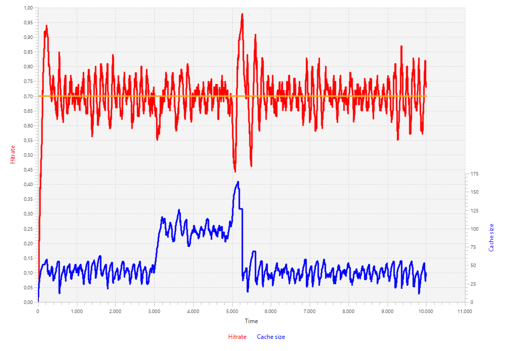

Although Ziegler-Nichols' results seemed poor, the results of Cohen-Coon are actually worse. The system is oscillating so much that changes in demand are not even noticeable. From this it becomes clear that parameters for the PID controller are not what we want in this case.


Using lower values for the controller the system seems to work something better, as shown by the results of the AMIGO simulation. The hit rate seems to track the setpoint better than before, the number of oscillations is less and their amplitude is smaller. However, it now takes longer for the system to respond to demand differences.

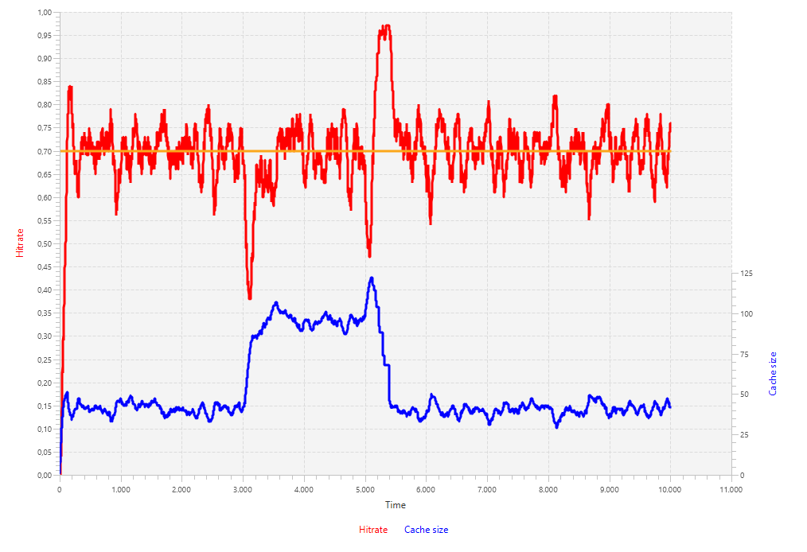

To solve this issue, we will keep the integral part at a low value (`ki = 2`) and set the proportional part of the controller at a value in the order of Ziegler-Nichols and Cohen-Coon (`kp = 200`). This gives better results: fewer oscillations and a quicker response to demand changes.

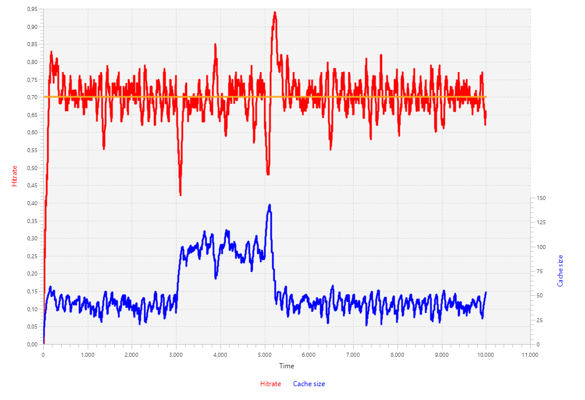

## Summary
The cache is a typical example of how to use feedback control in practice. Analyzing the case, we found that the cache requests could be viewed as Bernoulli trials and that we needed an average of the last 100 trials to get a hit ratio with about 95% accuracy.

Further analysis in the behavior of the cache system revealed the static process characteristics as well as the internal dynamics, which both need to be taken into account when choosing the values for the control system's PID controller. To measure the **static process characteristics**, we just have to turn on the controlled system in an open-loop setting without controller, apply a steady input value and wait until the system has settled down, while recording the outputs. If possible, perform multiple simulations with different kinds of parameters to get a wider perspective of this part of the system's behavior.  
The **dynamic response** is measured by turning on the system and measure what happens when you apply a sudden input change. These results are then analyzed by doing geometric constructions on the tangent or fitting a model through the data. The parameters obtained from this can be used to calculated the factors of the PID controller.

For the cache examples we used these analyses to come up with some values that would give a satisfactory performance. Here we had to make a trade-off between the number and size of the oscillations and the speed with which the system deals with demand changes.

#Server Scaling
In cloud computing we often deal with a complex system that takes in jobs, distributes them over the system, where they are executed. For a simple cloud based system that is based on an *[Infrastructure as a Service](http://en.wikipedia.org/wiki/Cloud_computing#Infrastructure_as_a_service_.28IaaS.29)* architecture, the jobs are often taken in by a head node that distributes them over multiple worker nodes. These worker nodes are often leased from a cloud provider (Amazon EC2, Microsoft Azure, etc.), where you only pay for the time they are used. Once a job is finished, the result is send back to the head node, which returns it to the user.

While creating a cloud application you have a number of issues to deal with. Your system should run with *as less human intervention as possible*. This means that you have to implement some smart algorithms to get a good performance. Your customers will send you jobs to be executed and don't like to wait a long time for their results to come back. Therefore you need to *lease and release* virtual machines depending on how many job are in the system and what their loads are. In literature this is also referred to as *elasticity* or *auto-scaling*. Also jobs need to be scheduled or distributed over the available virtual machines evenly, such that every jobs can be completed as fast as possible.

A challenging question in this whole problem is when to lease an extra machine? After all, it takes a couple of minutes for a new machine to be up and running and after that time, the machine might not be needed or it turned out that only one new machine was not enough. And when to release a machine? In fact, you don't know whether or not you will urgently need the machine seconds after its release.

## A first approach
The underlying problem is typically a problem that can be solved using feedback control. Let us first consider a simplified version of this problem, where we will assume the following:

1. Control actions are applied periodically, with constant intervals in between.
2. In the intervals between in control actions, jobs come in at the head node and are handled by the worker nodes
3. If a job comes in and no worker nodes are available, then the job is send back as a failure. Jobs will not be queued, so there will be no accumulation of pending jobs.
4. We can obtain the number of incoming and handled jobs for each interval.
5. The number of jobs that arrive during each interval is a random quantity, as is the number of jobs that are handled by the worker nodes.
6. Leasing a worker does not take any time. They are immediately available and do not need any time to spin up!

This set of specifications will seem weird at first glance, but will later turn out to be a nice starting point for approaching the general problem of elasticity. From a control perspective, the absence of a queue is important: a queue is a form of memory, which leads to more complicated behavior and internal dynamics.

### System design
With this set of specifications in mind, we can now define the input and output variables for the controlled system. The number of active servers will be the control input variable. The output will be the success ratio, which is defined as the ratio of completed to incoming jobs. The goal is to maximize this ratio and get it as close to 100% as possible.

This design results in the following implementation for the `ServerPool` that we will use in our simulations. Here `server` is a function that indicates how many jobs are handled by the system and `load` is a function that determines how many jobs are submitted per interval. We will discuss implementations of these functions later. Finally, `n` is the number of workers that are available.

```scala
class ServerPool(n: Int, server: () => Double, load: () => Double, res: Double = 0.0) extends Component[Int, Double] {

	def update(u: Int): ServerPool = {
		val l = load()

		if (l == 0) {
			new ServerPool(n, server, load, 1)
		}
		else {
			val nNew = math.max(0, u)
			val completed = math.min((0 until nNew).map { _ => server() }.sum, l)
			new ServerPool(nNew, server, load, completed / l)
		}
	}

	def action: Double = res

	def monitor = Map("Completion rate" -> res, "Servers" -> n)
}
```

###Tuning the controller
Just as we did in the previous case study, we will now look at the static process characteristics, which determines what the size and direction of the ultimate change in the process output is when an input of a certain size is applied. Again we simulated multiple scenarios and came to the following figure:

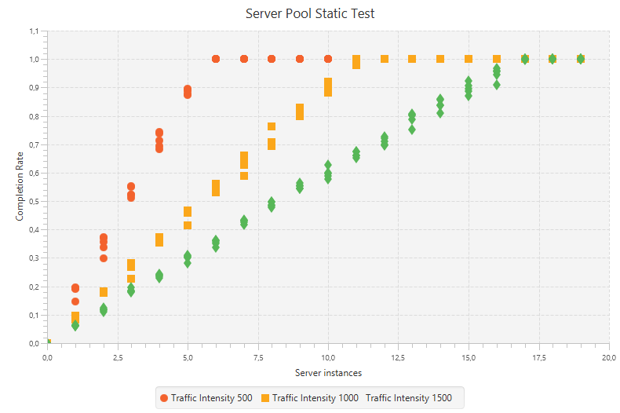

This shows that the success rate is proportional to the number of worker nodes until there are enough workers to handle all submitted jobs. Also notice that the slope and saturation point are determined by the traffic intensity.

Performing a dynamic response test is not necessary, since we can already conclude that there are no partial responses. When `n` worker nodes are requested, we will get them all (possibly after some delay); not a portion at first and the rest later! Although this may seem good news at first, we have to realize the consequences of not having partial responses. After all, we need to find values for a controller to act in the control loop which only can be found by measuring a delay τ and a time constant T. However, in this case there is no delay, causing the tuning formulas end up in dividing by zero! Therefore we need to find another method to get to these controller values.

Luckily we can combine the three types of tuning formulas and come up with the following set of formulas:

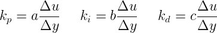

Here *Δu* is the static change in the control input and *Δy* is the corresponding change in the control output. The values for *a*, *b* and *c* are typically chosen somewhat arbitrarily in the following ranges:

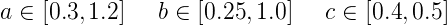

From the measurements taken in the static process characteristics we can see that *Δu* = 5 and *Δy* = 0.45 for the orange line. With that in mind we choose `kp = 1` and `ki = 5`.

We implement a first simulation that runs for 300 time units and has a setpoint of 0.8 until 100 time units and 0.6 afterwards. Notice that these are far from ideal, since we actually want a setpoint of 1.0. Since there are some issues with this value as a setpoint (as discussed later) we will stick to these lower values for now.

The `server` function is based on a [beta distribution](http://en.wikipedia.org/wiki/Beta_distribution), since this makes sure that every worker in the model does some finite work. The `load` function is based on a normal distribution but changes over time, such that the simulated workload is not always the same.

```scala
val global_time = 0

def simulation(): Observable[Double] = {
	def time: Observable[Long] = (0L until 300L).toObservable observeOn ComputationScheduler()
	def setpoint(t: Long): Double = if (t < 100) 0.8 else 0.6
	
	def server() = 100 * Randomizers.betavariate(20, 2)
	def load() = {
		global_time += 1

		if (global_time < 200) Randomizers.gaussian(1000, 5)
		else Randomizers.gaussian(1200, 5)
	}
		
	val p = new ServerPool(8, server, load)
	val c = new PIDController(1, 5) map math.round map (_ toInt)

	Loops.closedLoop(time map setpoint, 0.0, c ++ p)
}
```

Running this simulation will result in the following chart:

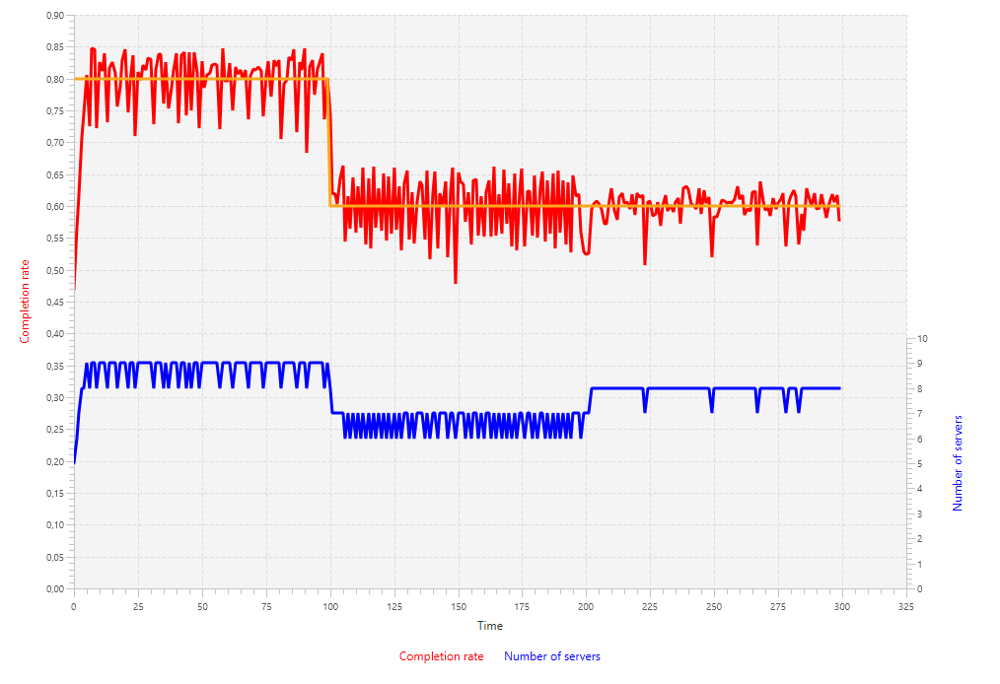

These results show that in the first 100 time units the number of servers oscillates between 8 and 9. Clearly 8 workers is often not enough, whereas 9 is too much. We see the same thing happen between time units 100 until 200, where 6 workers is too few and 7 is too much.

Also the completion rate does not perform well. It oscillates with amplitudes of 5 to 10 percent. Notice that the diminishing of the oscillations in the last part of the simulation (time units 200 until 300) is not due to a mechanic in the system, but rather a change in the amount of traffic.

### Getting close to 100 percent
Of course having a completion rate of 60% or 80% is not exactly the behavior we would expect from a cloud based system. We want all jobs to be completed and none being rejected. Therefore we prefer to have the completion rate at 100%. Taking a closer look at the theory behind feedback control systems will however reveals an important thing we cannot forget: if our setpoint value is 100% (or 1.0), then the tracking error can never be negative and hence no workers can be released in this particular example!

A simple solution to this would be to choose a setpoint value sufficiently close to 1.0, for example 0.995. But choosing this will face us with an unusual asymmetry in the tracking error. Everything from 0 to 0.995 produces a positive error, whereas everything from 0.995 to 1.0 causes a negative error. In a PID controller this means that control action that tend to increase the number of workers will be 100 times stronger than those who will decrease the number of workers.

This is fixable by applying different weights to positive and negative control actions of a PID controller. In the following implementation of `AsymmetricPIDController` we apply a ratio of 1:20 for positive and negative control actions.

```scala
class AsymmetricPIDController(kp: Double, ki: Double, kd: Double = 0.0, integral: Double = 0, deriv: Double = 0, prev: Double = 0)(implicit DT: Double) extends Component[Double, Double] {

	def update(error: Double): AsymmetricPIDController = {
		val e = if (error > 0) error / 20.0 else error

		val i = integral + DT * e
		val d = (prev - e) / DT

		new AsymmetricPIDController(kp, ki, kd, i, d, e)
	}

	def action = prev * kp + integral * ki + deriv * kd

	def monitor = Map("Asymmetric controller" -> action)
}
```

This results in a simulation that is improved a bit with respect to the first simulation, but still gives large oscillations in the number of servers and has completion rates that differ up to 10% of the actual setpoint.

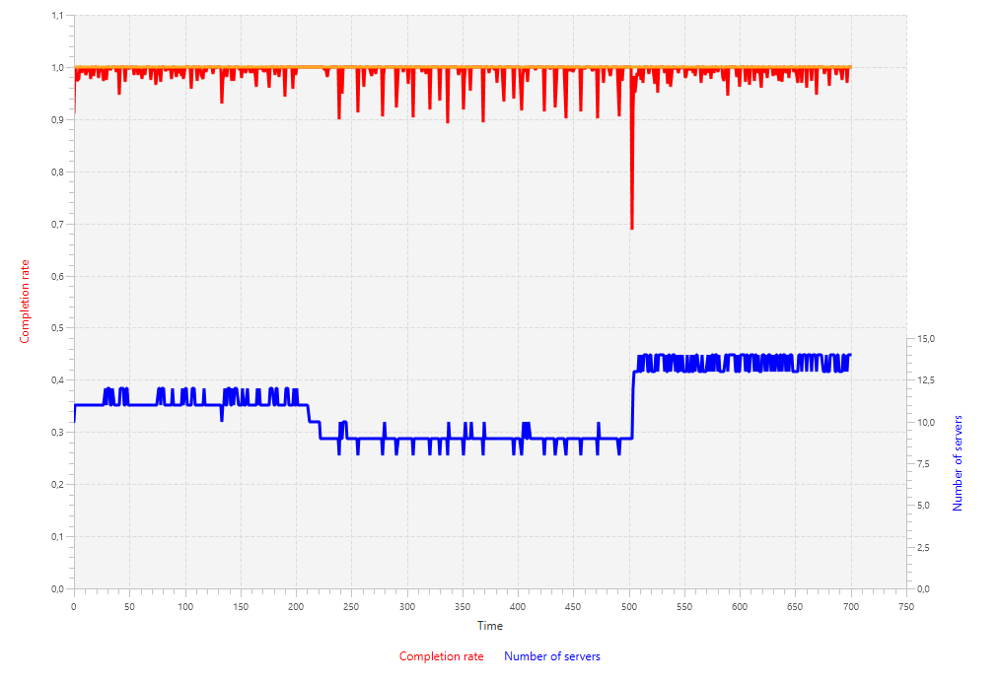

### A better approach
At this point we need to take a step back and look at what we are really facing. First of all, it should be clear by now that the control input must be a positive integer. We can only have a whole number of workers; not halves or thirds are allowed. Secondly, until now we have looked at the *magnitude* of the error, rather than the *sign*.

With these two things in mind, lets create a control strategy that is way simpler than the PID controller's strategy:

1. Let the setpoint be 1.0; causing the tracking error to never be negative.
2. If the tracking error is positive, add an extra worker to the worker pool.
3. If the tracking error is zero, do nothing.
4. Periodically decrease the number of workers by 1 and see whether a smaller number is sufficient.

Step 4 is crucial in order to allow for workers to be released. This can be improved even further by scheduling trial steps more frequently after releasing a worker than after leasing a worker. Implementing this in the simulation framework results in the following `SpecialController`:

```scala
class SpecialController(period1: Int, period2: Int, time: Int = 0, res: Int = 0) extends Component[Double, Double] {

	def update(error: Double): SpecialController = {
		if (error > 0)
			new SpecialController(period1, period2, period1, 1)
		// at this point we know that the error must be 0
		else if (time == 1)
			new SpecialController(period1, period2, period2, -1)
		else
			new SpecialController(period1, period2, time - 1, 0)
	}

	def action = res

	def monitor = Map("Special controller" -> action)
}
```

Notice that this is an incremental controller: it does not keep track of the number of leased workers but rather gives instructions on leasing or releasing any machines. Therefore we need to include an `Integrator` between the controller and the plant.

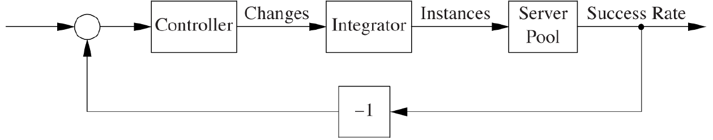

A simulation using this approach is very effective, as shown in the following chart. The number of servers stays constant and periodically checks whether a worker could be released. Between time units 500 and 600 we can nicely see the effect of scheduling more frequent test steps after a successful release. Three times in short period of time the controller tries to lower the number of workers. The first and second time, this is successful, the third time it turns out that this worker is really needed.

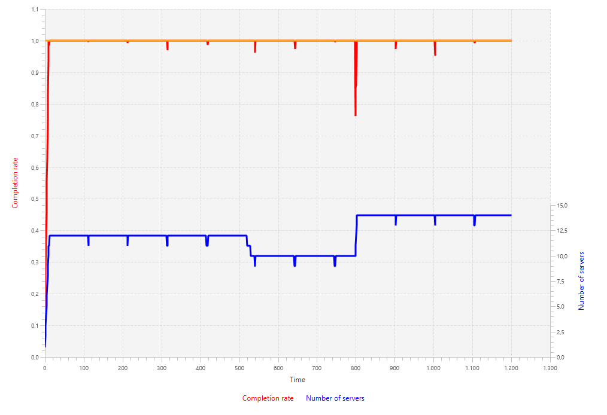

## Spinning up the server
Until now we have made the assumption that newly requested servers are available instantaneously. In practice however, it often takes about a minute or 2 until a requested server is available. Given that the control actions take place on the order of seconds, this is simply too big of a delay to be ignored.

A rule of thumb in designing feedback loops is to "*redesign the system to avoid delay*". Although this might seem strange at first, it is worth taking seriously, since alternative like the [Smith predictor](http://en.wikipedia.org/wiki/Smith_predictor) are even more complicated!

In our case, we can have a set of "*warm standbys*" that are controlled by a separate feedback loop. Instead of requesting new servers and waiting a couple of minutes for them to be active, we can just get extra instances from the second feedback loop. The latter controls the number of standby instances and is supposed to act in a time scale that is equal to the time it takes to spin up a new instance. With this last choice, we allow the new instances to be again available immediately from the perspective of the second loop.

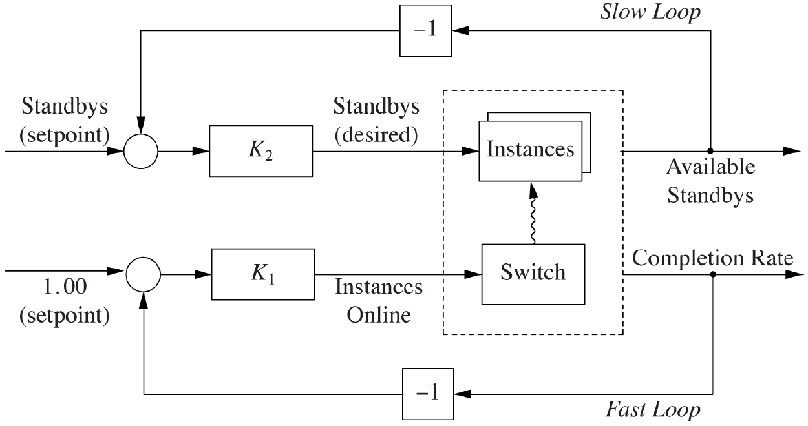

## Summary
In cloud computing we often deal with a (complex) system that receives jobs from its users and distributes those over several workers. These workers are leased by cloud providers and are only paid for the time they are used. One of the challenges while implementing such a system is to come up with a good policy for auto-scaling. When to lease or release a machine?

A simplified version of the problem assumes that jobs will never be queued and instead be rejected if immediate processing is not possible. Besides that we assume that newly requested servers are directly available; no spin up time is required. We found that a PID controller is not appropriate to use in this setup, especially as the setpoint requests a completion rate close to 100%. Instead we used a simpler control strategy that performs great with the goal of 100% completion rate.

# Conclusion
In feedback control we continuously compare the output of a controlled system with a desired reference value and supply new input values to the system in order to counteract any deviations in the output from the reference value. Typically in this kind of systems the difference between the control output and the reference value ([setpoint](#the-components-of-a-closed-loop-system)) is taken into a Controller that transforms the error into a new control input for the controlled system.

The controlled system can be an actual machine/program/system but instead it also might be a [simulation](#simulation). The latter is often advisable while designing a feedback control system, since (I) it provides a way to get a better understanding and intuition for the abstract problem and the internal workings of the system, (II) it is most often not possible to do extensive testing and experimenting on real-world machines, (III) it provides a way of proving the correctness of the feedback system.

The controlled system is likely to exhibit some form of [lag, delay or other internal dynamics](#system-dynamics). These cause the controller to have a more difficult job and often result in a less accurate functioning feedback system. In some cases it is however possible to redesign the feedback system to the point where it does not have these internal dynamics.

Controllers come in various types: most used is the [PID controller](#pid-control), which is composed of a proportional, integral and derivative controller, all using their one parameter (,  and  respectively). Occasionally we find ourselves in situations where a PID controller is not good enough. In those cases an [on/off controller](#onoff-control) or a controller that is based on another control strategy might be useful. An example of the latter can be found in the [case study on server scaling](#A-better-approach).

There is not one definite approach when it comes to tuning a PID controller. Two cases can be distinguished: when the controlled system has an immediate response without internal dynamics, an analysis of the static process characteristics will suffice. In this case the PID parameters depend on the [ratio of the change](#tuning-the-controller) in the control input and the corresponding change in the control output.

In the other case (when the system does exhibit internal dynamics) there is [not one definite approach](#dynamic-response) when it comes to tuning a PID controller. The process starts with doing analysis of both the static process characteristics and the system's dynamic response. Note that both these tests are done in an open-loop setting without the presence of a controller. Based on these tests, values for K, τ and T need to be found by either fitting a model or using the [geometric construction](#finding-the-first-values). These values translate into the PID parameters by applying either one of the [Ziegler-Nichols, Cohen-Coon or AMIGO method](#calculating-the-pid-parameters). In practice it will turn out to be useful to use all three methods and combine the results to get good parameters for the PID controller.

Feedback control systems have proven to be successful for a long time in a wide variety of expertise. Now it is time to embrace this technique and apply it in the field of computer science!